# Tarea_03_
Tarea 3 para el curso ICP5006-1 "Medición y análisis dimensional de datos políticos".  (Nuevo repositorio porque no sé por qué no se actualizaba el anterior). 

# Análisis del Rendimiento Escolar en Chile (2024)
**Ministerio de Educación – Datos oficiales de Rendimiento por alumno**

(Para mayor información, te invito a revisar el script en la carpeta "01_script")

---

## 0. Introducción

La presente tarea tiene como objetivo analizar cómo diversas características de los establecimientos educacionales —tales como su régimen de dependencia, ubicación geográfica, modalidad y contexto territorial— se relacionan con el rendimiento promedio de los estudiantes del sistema escolar chileno durante 2024. Se utilizó información oficial del Ministerio de Educación. Para ello se desarrolla un análisis estadístico integral que combina exploración descriptiva, detección de valores atípicos, contrastes de hipótesis y modelos de regresión.

Así, este trabajo quiso responder una serie de preguntas específicas que fueron surgiendo de manera secuencial durante el proceso analítico, de modo que el orden de las secciones refleja la lógica con la que se fue construyendo el razonamiento y las hipótesis asociadas. Es decir, no es el órden más "lógico", pero se quiso mantener así para mostrar este tren de pensamientos. Se deja la versión ordenada de manera más integral para el futuro.

A lo largo del documento se trabaja con pruebas estadísticas, visualizaciones y comparaciones entre grupos, permitiendo observar cómo ciertas desigualdades estructurales del sistema educativo chileno se manifiestan en los resultados académicos. De esta manera, el propósito general es identificar patrones, contrastar rendimiento entre distintos tipos de establecimientos y evaluar si las diferencias observadas son estadísticamente significativas.

### 0.1 Librerias necesarias

Antes de empezar lo primero será cargar las siguientes librerias.

```{r warning=F}
library(tidyverse) #manipular datos
library(stringr) #limpiar textos
library(stringi) #limpiar textos
library(gt) #generar tablas
library(ggplot2) #generar gráficos
library(scales) #generar gráficos
library(ggpubr) # ggboxplot 
library(broom) #para tidy()
library(rcompanion) #para cramerV()
library(modelsummary) # tablas de regresión amigables
library(factoextra) # graficos de PCA
```
---

## 1. Cargar base de datos

Recordando la tarea 2, la base de datos con la que estaremos trabajando en esta ocasión será la misma de la última vez. Al ser muy pesada no pudo ser subida a github. Sin embargo, en el repositorio "Tarea 2" está el link para la base original del Centro de Estudios del Ministerio de Educación de Chile y los pasos para construirla. Recomiendo ir a revisar ese repositorio antes de meterse de lleno en este pues es complementario e incorpora un análisis descriptivo más básico de la base de datos. 

--- 

## 2. Análisis descriptivo (parte 2)

En esta sección se siguieron los análisis descriptivos realizados inicialmente en la Tarea 2. 

### 2.1 Asistencia escolar por nivel y dependencia

Para analizar la asistencia escolar según el nivel de enseñanza y el tipo de dependencia se realizaron una tabla de frecuencias y un gráfico por cada nivel de enseñanza. 

Los análisis de asistencia escolar revelan patrones consistentes en función del tipo de dependencia administrativa. En todos los niveles de enseñanza regular (Básica Niños y Media Jóvenes), los establecimientos particulares pagados registran los porcentajes de asistencia más altos, superando el 90% en ambos casos. Le siguen los particulares subvencionados con valores entre el 86% y 87%, mientras que los establecimientos municipales y de servicios locales de educación presentan tasas menores, generalmente entre el 79% y 84%. Esta jerarquía se mantiene a lo largo de la educación formal, confirmando una relación positiva entre el tipo de dependencia y la asistencia escolar.

La situación cambia drásticamente en las modalidades de Educación de Adultos y Educación Especial. En la educación de adultos, todas las dependencias muestran tasas de asistencia considerablemente más bajas, con valores que oscilan entre el 54% y 66% en la mayoría de los casos, y apenas alcanzan el 79% en el caso excepcional de los particulares pagados en Básica Adultos. La Educación Especial también presenta porcentajes reducidos, con promedios que no superan el 73% incluso en la dependencia con mejor desempeño (municipal). Estos resultados sugieren que factores específicos de estas modalidades, como responsabilidades laborales, edad de los estudiantes o necesidades educativas especiales, pueden tener impactos significativamente en la asistencia escolar.

**Tabla**
 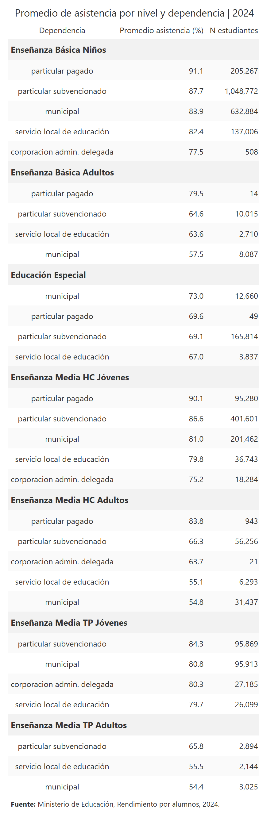 

En el caso de los gráficos, al intentar hacer uno único toda la información estaba muy junta y no se entendía bien. Es por ello, que consultando con grok (IA), me entregó un código para poder hacer un loop. Es decir. que haga un gráfico por cada uno de las opciones de nivel de enseñanza. Me he dado cuenta también que me gusta mucho la función de `cat`, pues permite tener un mensaje de verificación de si todo salió como debiera salir, lo cual es importante al realizar este tipo de ejercicios pues permite hacer un seguimiento más facil. Adjunto el código y los gráficos a continuación:

**Código**
```{r}
#Este es el inicio del loop
for (nivel_actual in unique(asistencia$nivel_enseñanza)) {
  
  # Nombre limpio y corto para el archivo
  nombre_archivo <- paste0("02_output/grafico_asistencia_prom_",
                           str_trunc(str_replace_all(nivel_actual, "[ /]", "_"), 40),
                           ".png")
  
  ggplot(asistencia |> filter(nivel_enseñanza == nivel_actual),
         aes(x = reorder(tipo_dependencia, prom_asistencia),   # ordena de mayor a menor asistencia
             y = prom_asistencia,
             fill = tipo_dependencia)) +
    geom_col(width = 0.7, alpha = 0.9) +
    geom_text(aes(label = paste0(prom_asistencia, "%")),
              vjust = -0.6, fontface = "bold", size = 4.5, color = "black") +
    scale_fill_manual(values = c(
      "municipal"                      = "#3498db",
      "particular subvencionado"       = "#2ecc71",
      "particular pagado"              = "#e74c3c",
      "corporacion admin. delegada"    = "#9b59b6",
      "servicio local de educación"    = "#f1c40f"
    )) +
    scale_y_continuous(limits = c(0, 100),
                       expand = expansion(mult = c(0, 0.1))) +
    labs(title = paste("Promedio de asistencia -", nivel_actual),
         subtitle = "Por tipo de dependencia | Año 2024",
         x = "",
         y = "Porcentaje de asistencia promedio",
         caption = "Fuente: Ministerio de Educación, Rendimiento por alumnos, 2024.") +
    theme_minimal(base_size = 13) +
    theme(
      plot.title = element_text(face = "bold", size = 15),
      axis.text.x = element_text(angle = 45, hjust = 1),
      legend.position = "none"   # sin leyenda porque ya está en el eje x
    )
  
  # Guardamos el gráfico
  ggsave(filename = nombre_archivo, width = 11, height = 7, dpi = 300, bg = "white")
  
  cat("✔ Guardado:", nombre_archivo, "\n")
}
```
 
   
  
  
  
 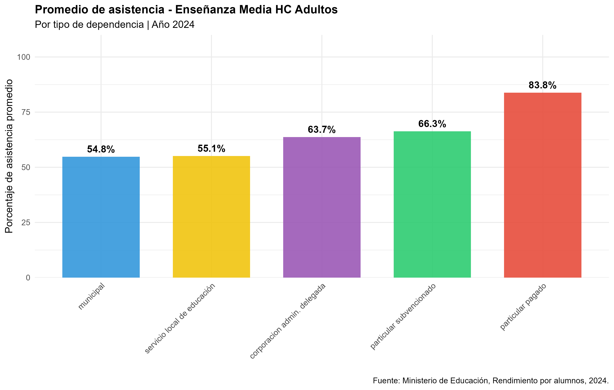 
  
 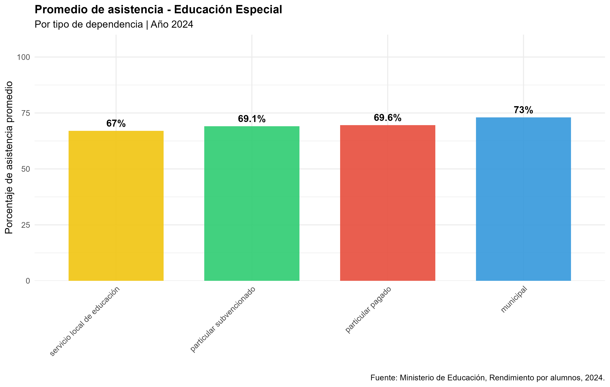 


### 2.2 Promedio general de notas por nivel y dependencia

La tabla revela brechas consistentes en el rendimiento académico según el tipo de dependencia, con diferencias que se mantienen a lo largo de casi todos los niveles de enseñanza.

Primero, los establecimientos particulares pagados obtienen los promedios más altos en todos los niveles donde están presentes, destacando en Enseñanza Básica Niños(6.3 vs 5.7 en municipales) y Enseñanza Media HC Jóvenes (6.2 vs 5.4 en municipales).

Segundo, los establecimientos municipales y de servicios locales presentan los promedios más bajos en prácticamente todos los niveles, con valores particularmente críticos en Educación Especial (2.2 en municipales y 2.3 en servicios locales) y Educación de Adultos(entre 3.6 y 3.8 en municipales y subvencionados)

Tercero, la Educación de Adultos presenta promedios sistemáticamente más bajos que la educación regular, independientemente de la dependencia, lo que podría reflejar desafíos específicos de esta modalidad (edad, responsabilidades laborales, tiempo de estudio, etc.)

**Tabla**
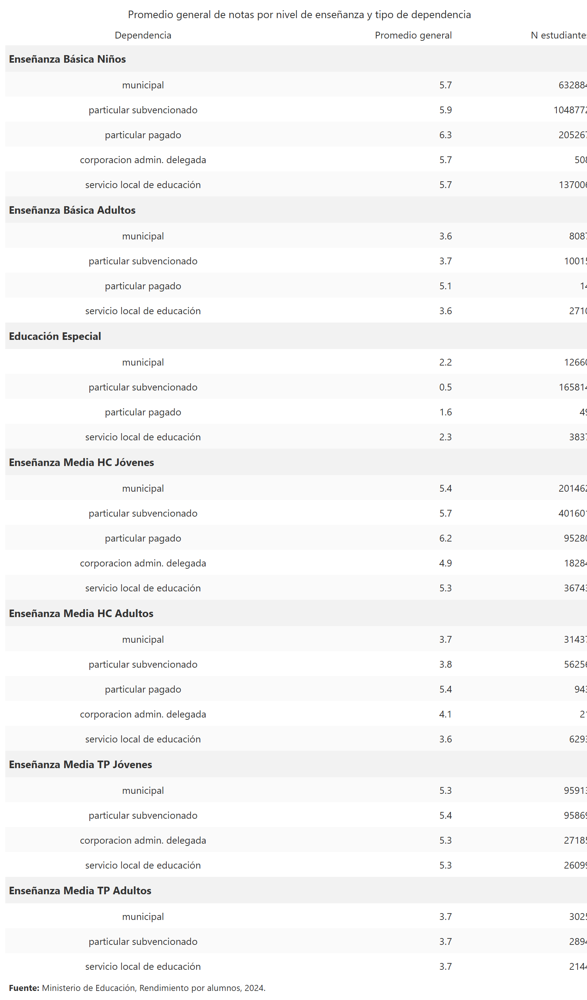  

**Gráfico**

A través de este gráfico se permite tener una mirada general de la situación. Destacándose que la brecha más pronunciada se encuentra en la Educación Básica Niños y Media HC Jóvenes, donde la diferencia entre particulares pagados y municipales supera los 0,6 puntos. 

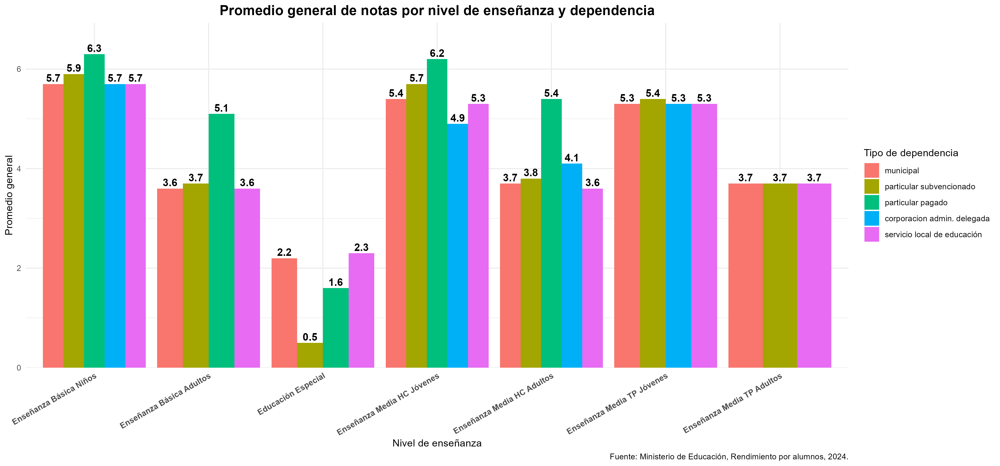  

### 2.3 Promedio general de notas por tramos según tipo de dependencia
Para analizar el rendimiento académico en función del tipo de dependencia administrativa, se categorizó el promedio general de notas en dos tramos: “Menor a 4.0 (Reprobado)” y “4.0 a 7.0 (Aprobado)”. Luego, se calcularon las frecuencias y porcentajes de estudiantes en cada tramo, desglosados por nivel de enseñanza y tipo de dependencia, lo que permitió identificar patrones de rendimiento diferenciados según el tipo de establecimiento y modalidad educativa.

Por un lado, en Educación Básica Niños,la tasa de reprobación es más alta en establecimientos municipales (6.2%) y de servicios locales de educación (6.7%), mientras que en los particulares pagados es solo del 1.8% (más del triple!). Los particulares subvencionados presentan un 3.0% de reprobación.

Por otro lado, en Educación de Adultos (tanto Básica como Media), las tasas de reprobación son notablemente más altas (entre 40% y 43% en municipales y subvencionados), lo que sugiere mayores desafíos en esta modalidad.

Finalmente, en Educación Especial, se observan tasas de reprobación elevadas, especialmente en particulares subvencionados (92.3%), lo que podría reflejar criterios de evaluación diferenciados o necesidades educativas especiales no cubiertas.

**Tabla**

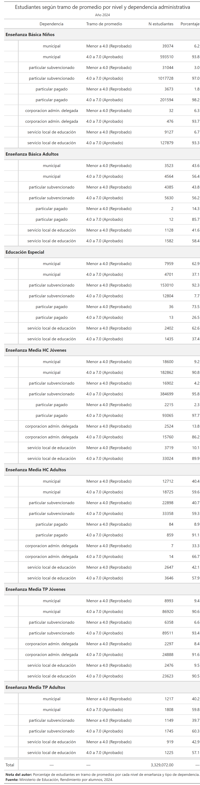  

**Gráfico**

Ahora para el gráfico, decidí hacer uno por cada nivel de enseñanza (igual que en 2.1) de modo que se puedan comparar los niveles de aprobación y reprobación según el tipo de dependencia. En todos los niveles, las barras verdes (aprobación) son significativamente más altas en los establecimientos particulares pagados, seguidos por los particulares subvencionados, mientras que los municipales y servicios locales de educación presentan mayores proporciones de reprobación (barras rojas).

Esta visualización aporta más evidencia a que la dependencia administrativa está asociada con diferencias sistemáticas en el rendimiento académico, posiblemente vinculadas a disparidades en recursos, apoyo pedagógico, perfil socioeconómico de los estudiantes y condiciones de enseñanza.

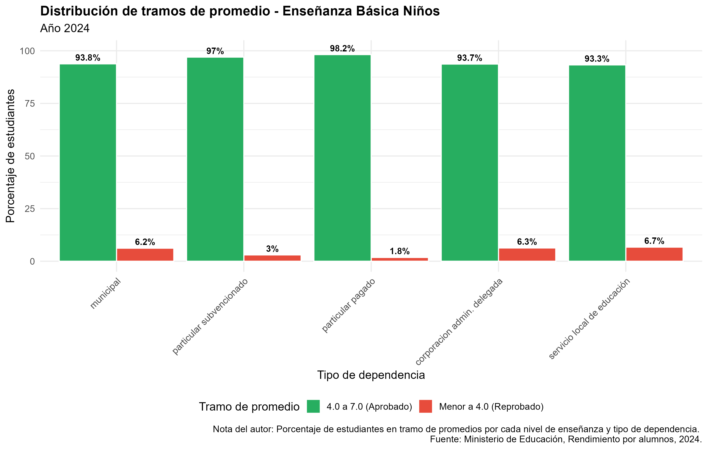  
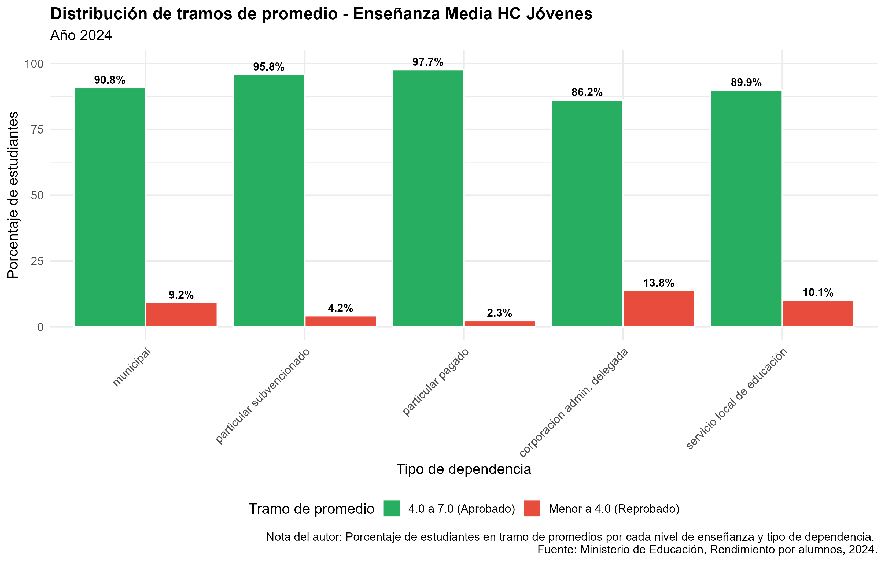  
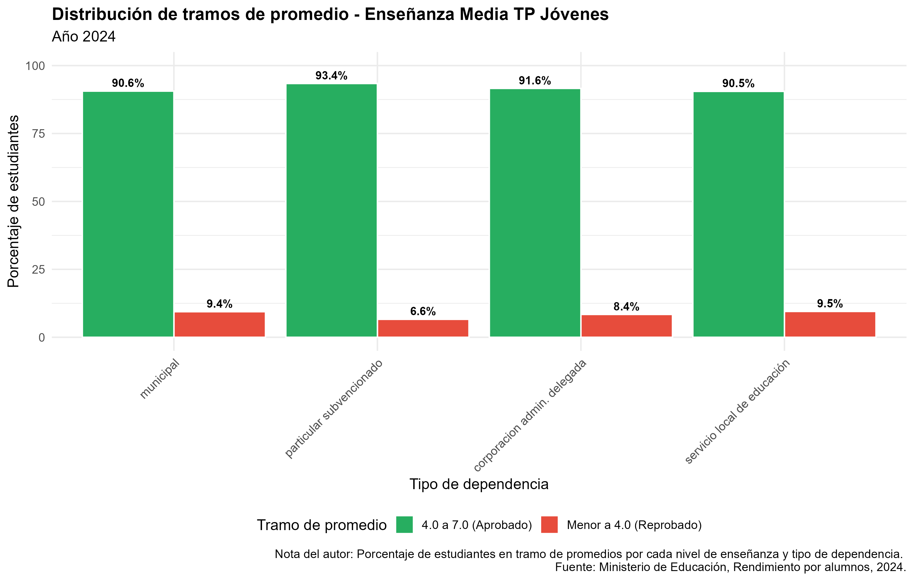  
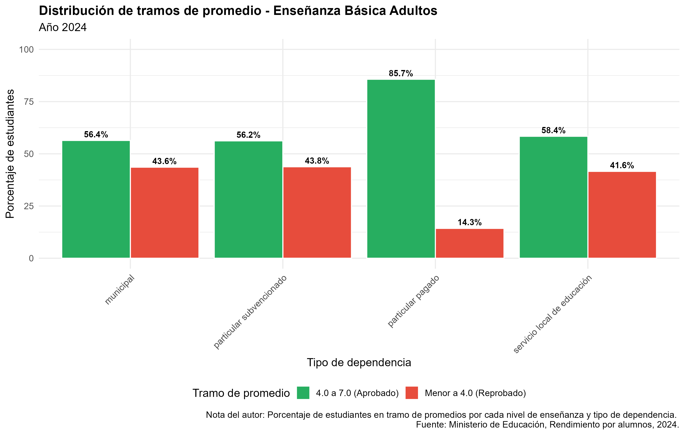  
  
 
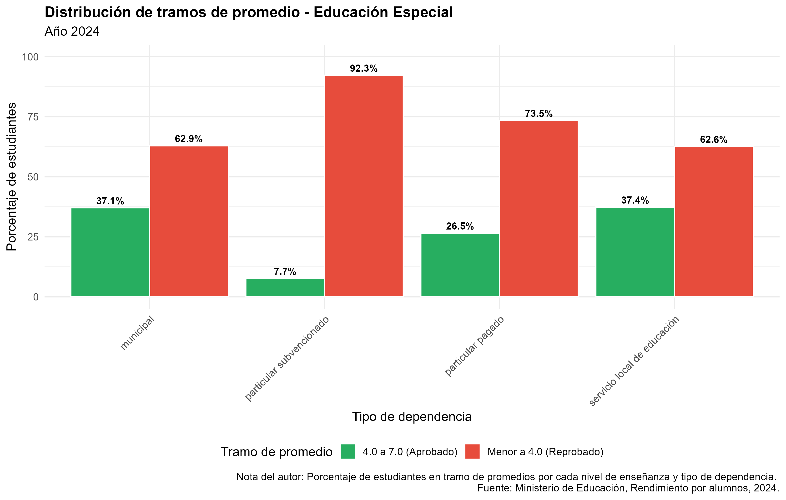  

---

## 3. Test de hipótesis

### 3.1 Según modalidad (Científico Humanista - Técnico Profesional)

Para ello, primero será necesario modificar nuestra base de datos de forma que el curso y la modalidad (HC o TP) sean dos variables distintas. Mantenemos a su vez otras variables de interés como promedio, asistencia y promedio. En vez de agruparlos según cursos, como se hizo en ocasiones anteriores, esta vez se mantendrán los datos individuales con el fin de que la mayor cantidad de observaciones robustezca nuestras pruebas. 

#### 3.1.1 ¿Es mayor el promedio de estudiantes de modalidad Científico Humánista (HC) que el de Técnico Profesional (TP)?

Para ello, haremos un test de hipótesis, siendo nuestras hipótesis las siguientes: 

H0: Promedio de HC no es mayor que el de TP `HC ≤ TP`
H1: Promedio de HC es mayor que el de TP  `HC > TP`

**Resultados**

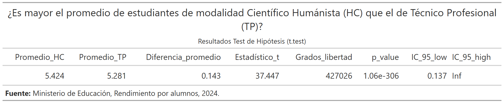  

**Análisis**

La modalidad HC muestra un promedio levemente mayor que la modalidad TP (5,42 vs 5,28). Pese a ser una diferencia relativamente pequeña, el test t unilateral indica que es estadísticamente significativa debido al gran tamaño de la muestra, lo cual se ve reflejado en su p-value (< 2,2e-16). Por lo tanto, existe evidencia estadísticamente fuerte de que los estudiantes de modalidad Científica Humanista obtienen un promedio mayor que los de modalidad Técnico Profesional. Es decir, existe una fuerte evidencia en contra de la hipótesis nula H0.

#### 3.1.2 ¿Es el porcentaje de promovidos distinto entre las modalidades Científico Humanista (HC) y Técnica Profesional (TP)?

Para ello, haremos un test de hipótesis, siendo nuestras hipótesis las siguientes: 

H0: Porcentaje de estudiantes promovidos de HC no es distinto que el de estudiantes de TP `HC = TP`

H1: Porcentaje de estudiantes promovidos de HC es distinto que el de estudiantes de TP  `HC ≠ TP`

**Resultados**

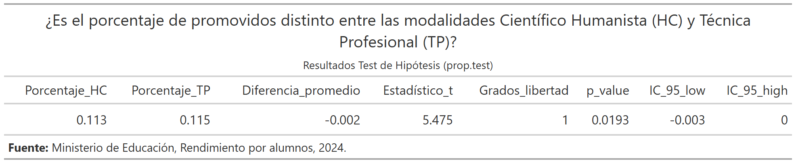  

**Análisis**

El test de proporciones indica que existe una diferencia estadísticamente significativa entre la proporción de estudiantes promovidos de modalidad HC y TP (p = 0,019). De esta manera, es posible establecer que existe una fuerte evidencia en contra de la hipótesis nula H0. Sin embargo, aunque la modalidad TP presenta una proporción ligeramente mayor de promovidos (11,50% versus 11,33%), la magnitud de la diferencia es mínima (aproximadamente 0,17 puntos porcentuales), por lo que el efecto, si bien significativo, carece de relevancia práctica.

#### 3.1.3 ¿Está asociada la modalidad (HC o TP) con el género?

Para responder si existe una relación estadísticamente significativa entre la modalidad educativa (HC/TP) y el género de estudiantes se hace el siguiente test de hipótesis, siendo las hipótesis las que se muestran a continuación: 

H0: La modalidad educativa (HC/TP) es independiente del género. `distribución de género en HC = distribución de género en TP`

H1: La modalidad educativa (HC/TP) no es independiente del género. `distribución de género en HC ≠ distribución de género en TP`

**Resultados**

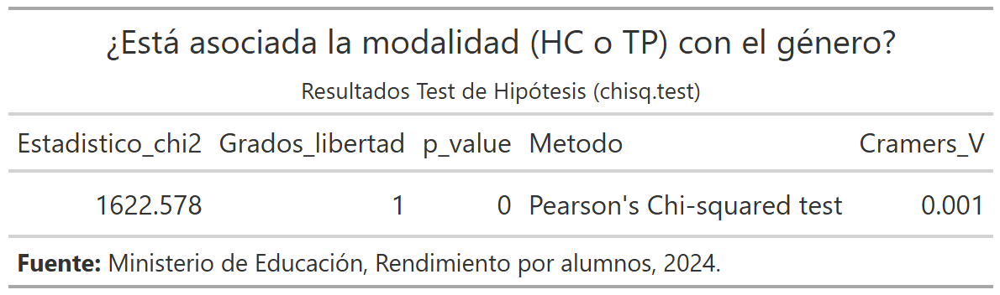  

**Análisis**

En base a los resultados mostrados en la tabla, es posible evidenciar que existe una asociación estadísticamente significativa entre modalidad (HC-TP) y género (p.value = 0 aprox). Por lo que es posible suponer que existe una fuerte evidencia en contra de la Hipotesis nula H0. Además, siguiendo una recomendación de ChatGPT, se ejecutó Cramer's V, el cual mide la fuerza de la asociación entre dos variables categóricas, como son en este caso la modalidad y el género. Al ser el valor de este 0,0007361, es posible decir que es aproximadamente 0. Es decir, indica que existe practicamente ninguna asociación entre las variables.

En resumen, aunque estadísticamente aparecen diferencias entre HC y TP en función del género, en términos "prácticos" dichas diferencias son irrelevantes, por lo que es posible interpretar que no existe asociación significativa entre género y modalidad educativa. 

##### 3.1.3.1 Tabla de frecuencia: estudiantes según modalidad y género

Al tener nociones previas sobre la existencia de diferencias de género en la modalidad Técnica Profesional, quise investigar más el resultado anterior. Por ello realicé una tabla de frecuencias (que no había hecho anteriormente). Esta, mostrada a continuación, muestra cuantos estudiantes hay por modalidad (HC y TP) y por género (masculino, femenino e indefinido). Se incorporan los porcentajes por modalidad de la distribución de género  `Porcentaje por modalidad (%)`y los porcentajes de estudiantes presentes en cada modalidad `Porcentaje total (%)`.

**Tabla de frecuencia**

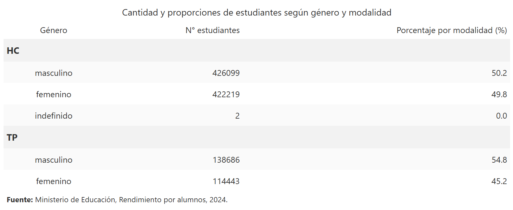  

**Análisis**

A través de la tabla de frecuencias es posible evidenciar que las diferencias absolutas por modalidad varían ligeramente entre HC y TP. En HC la proporción de hombres y mujeres es casi 50/50 (50,2 y 49,8 respectivamente), con una diferencia de solo 0,4 porcentuales. Por otro lado, en TP las diferencias de género son más grandes, alcanzando un valor de 9.6 puntos porcentuales. Se logra evidenciar que hay la proporción de estudiantes hombres (54,8) es mayor que la de mujeres (45,2).

¿Por qué si se evidencia una diferencia de género de casi 10 puntos porcentuales en la modalidad técnica profesional el valor de Cramer's V fue aproximadamente 0? La diferencia absoluta me parecía significativa, puesto que, en otras palabras, hay casi 10% más hombres que mujeres en la educación técnica profesional. Lo consideré aún más significativo si se toma en cuenta que existe una diferencia de 9,2 puntos porcentuales con la otra modalidad, por lo que quería saber la respuesta.

Al investigar un poco más de esta métrica pude comprender que esta mide la fuerza de asociación, siendo las diferencias muy pequeñas en términos de proporciones. Asimismo, influye que la muestra es muy grande, volviendose estas diferencias mínimas. 

¿La conclusión? Según las métricas utilizadas existe una diferencia estadísticamente significativa pero irrelevante. 

¿El aprendizaje? Incorporar análisis descriptivos, como la tabla de frecuencias desarrollada, permite complementar la información de las métricas. Esto pues puede que si bien los resultados de estas muestren diferencias irrelevantes, es necesario comprobarlo con cifras más precisas que permitan a la persona que investiga o toma la decisión de alguna política comprender mejor el panorama general.


### 3.2 Según territorio

#### 3.2.1 Según región: ¿Tienen los estudiantes de la Región Metropolitana un promedio de notas significativamente mayor que los estudiantes del resto de las regiones del país en el año 2024?

Para ello, se realiza el siguiente test de hipótesis, siendo nuestras hipótesis las mostradas a continuación: 

H0: El promedio de notas de los estudiantes de la Región Metropolitana no es mayor que el del resto del país `(μ_RM ≤ μ_Resto)`

H1: El promedio de notas de los estudiantes de la Región Metropolitana es mayor que el del resto del país
`(μ_RM > μ_Resto)`

**Resultados**

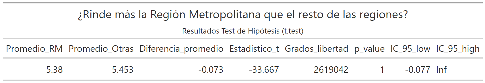  

**Análisis**

Así, el análisis no respalda la hipótesis inicial de que la Región Metropolitana tenga un rendimiento promedio mayor que el resto de las regiones. Por el contrario, el rendimiento promedio observado en la RM es significativamente menor, lo que se refleja en un estadístico t negativo (-33,667) y un valor p igual a 1 bajo la hipótesis alternativa de cola superior.
Por lo tanto, no es posible rechazar la hipótesis nula.

#### 3.2.2 ¿Tienen los estudiantes de establecimientos urbanos mayores resultados que los de establecimientos rurales?

H0: Los estudiantes de establecimientos urbanos no tienen mayores promedios que los de establecimientos rurales `(μ_urbano ≤ μ_rural)`

H1: Los estudiantes de establecimientos urbanos tienen mayores promedios que los de establecimientos rurales `(μ_urbano > μ_rural`

**Resultados**

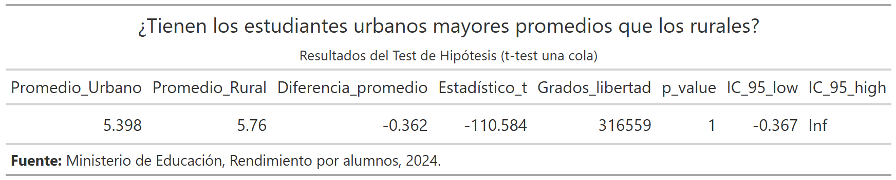  

**Análisis**

A través del análisis realizado, se evidencia que los estudiantes de establecimientos rurales presentan en promedio un rendimiento superior al de los estudiantes urbanos (5,398 vs. 5,760), lo cual es consistente con el signo negativo del t (-110.58). El p-value (1 > 0,05) implica que no existencia evidencia estadística para rechazar la hipótesis nula planteada.

### 3.3 Según tipo de dependencia

#### 3.3.1 ¿Existe una relación estadísticamente significativa entre la situación final del estudiante y el tipo de dependencia del establecimiento?

Para encontrar respuesta realizamos el siguiente test de hipótesis, siendo nuestras hipótesis las mostradas a continuación: 

H0: La situación final del estudiante es independiente del tipo de dependencia del establecimiento.

H1: La situación final del estudiante no es independiente del tipo de dependencia del establecimiento.

**Resultados**

  

**Análisis**

En base a los resultados es posible suponer que existe una asociación estadísticamente significativa entre la situación final del estudiante y el tipo de dependencia. Los resultados indican un estadístico χ² = 35881 con 16 grados de libertad, y un p-value < 2.2e-16, lo que permite rechazar la hipótesis nula. 

En consecuencia, existe una asociación estadísticamente significativa entre la situación final del estudiante y el tipo de dependencia. Esto implica que la distribución de promovidos, reprobados, retirados y trasladados varía sistemáticamente según el tipo de establecimiento en el que estudian.

#### 3.3.2 ¿Existen diferencias en el promedio general de los estudiantes según el tipo de dependencia administrativa del establecimiento?

Para encontrar respuesta realizamos el siguiente test de hipótesis, siendo nuestras hipótesis las mostradas a continuación: 

H0: No existen diferencias en el promedio general entre los distintos tipos de dependencia administrativa.

H1: Al menos un tipo de dependencia presenta un promedio general diferente al resto.


**Análisis**

A través de este análisis de varianza, es posible evidenciar la existencia de diferencias altamente significativas en el promedio general de los estudiantes según el tipo de dependencia administrativa del establecimiento. 

El alto valor F (17.741) indica que las diferencias entre tipos de dependencia son muy superiores a la variabilidad interna. Asimismo, el valor de p-value (< 2e-16) implica que existe evidencia estadística extremadamente fuerte contra H0. 

En otras palabras, el rendimiento promedio no es igual entre los tipos de dependencia. Esto implica que el tipo de administración del colegio sí influye de manera importante en el rendimiento académico promedio, más allá de factores individuales como esfuerzo o capacidad.

**Gráfico distribución promedio según tipo de dependencia administrativa**

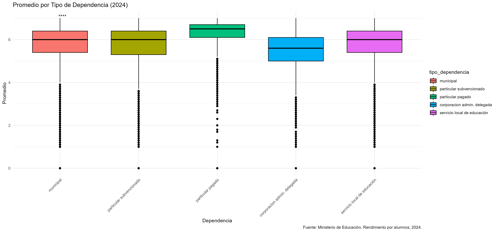  

Para complementar lo anterior y considerando que es más complicado de visualizar rapidamente las diferencias de promedio según tipo de establecimiento con la tabla anterior, se presenta el siguiente gráfico de cajas y bigotes.

A modo de recordatorio, las cajas representan el rango intercuartílico (IQR), siendo la linea que la cruza la mediana, mientras que los puntos corresponden a los valores atípicos u outliers.

El gráfico permite evidenciar que los establecimientos particulares pagados presentan los promedios más altos, con una mediana cercana o superior a 6,5. Los establecimientos particulares subvencionados, municipales y del servicio local de educación muestran medianas cercanas a 6,0, mientras que las corporaciones administradoras delegadas presentan medianas por debajo de 6,0 y cajas ligeramente más bajas. 

Por otro lado, los municipales y las corporaciones delegadas exhiben mayor dispersión e incluso outliers con promedios muy bajos. Es decir, la mayor variabilidad en estos sectores indica diferencias internas más amplias en desempeño. En cambio, los particulares pagados tienen una dispersión más estrecha, indicando mayor homogeneidad en el rendimiento.

---

## 4. Investigación de los outliers

### 4.1 Outliers en variables continuas (promedio y asistencia)

Primero se desarrolló (con la ayuda de la IA) una función que permitiera detectar outliers en variables continuas, como son promedio y asistencia. Esto se realiza usando el criterio del rango intercuartílico (IQR), también recomendado por la IA.

```{r}
#Función para detectar outliers en variables continuas (promedio y porc_asistencia)

detectar_outliers <- function(data, var) {
  data_var <- data %>% pull({{ var }})
  Q1 <- quantile(data_var, 0.25, na.rm = TRUE)
  Q3 <- quantile(data_var, 0.75, na.rm = TRUE)
  IQR_val <- Q3 - Q1
  lower <- Q1 - 1.5 * IQR_val
  upper <- Q3 + 1.5 * IQR_val
  outliers <- data %>%
    filter({{ var }} < lower | {{ var }} > upper)
  return(outliers)
}
```
#### 4.1.1 Outliers en promedio general

Se aplicó el criterio del rango intercuartílico (1.5 × IQR) para identificar valores atípicos en el promedio general. El análisis detectó 357.420 outliers. Una vez identificados los outliers en la variable promedio, se analizó su distribución por tipo de dependencia y por situación final, con el objetivo de evaluar si estos valores extremos se concentran en ciertos grupos institucionales o académicos. 

Los resultados indican que los valores extremos se concentran mayoritariamente en los establecimientos particulares subvencionados (233.761), seguidos por los municipales (90.884), lo cual sugiere una alta heterogeneidad interna en los promedios de rendimiento. 

A nivel académico, los outliers se encuentran en todas las situaciones finales, destacando los estudiantes promovidos (138.115) y aquellos que se trasladaron (110.233). Al observarse valores extremos en todas las categorías, incluyendo estudiantes promovidos, se sugiere que estos outliers no necesariamente representan bajo rendimiento, sino que son desviaciones importantes respecto de la distribución general.

En conjunto, este análisis sugiere que la presencia de outliers no responde únicamente a bajo rendimiento, sino también a trayectorias escolares más inestables o heterogéneas

*Outliers según tipo de dependencia*
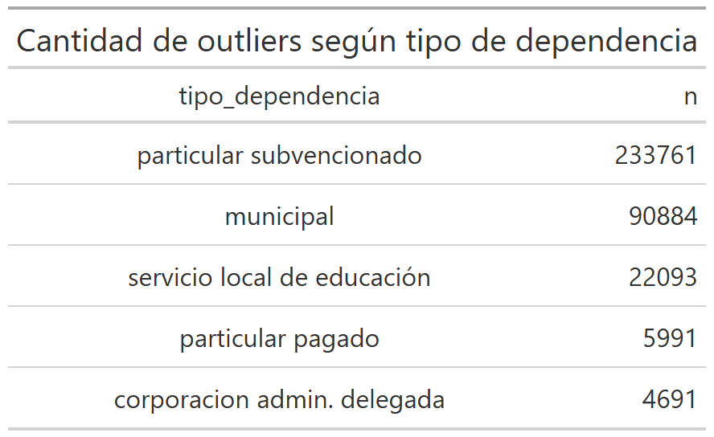  

*Outliers según situación final*
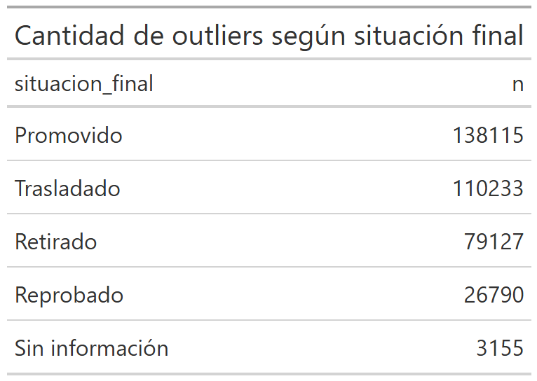  


**Gráfico**

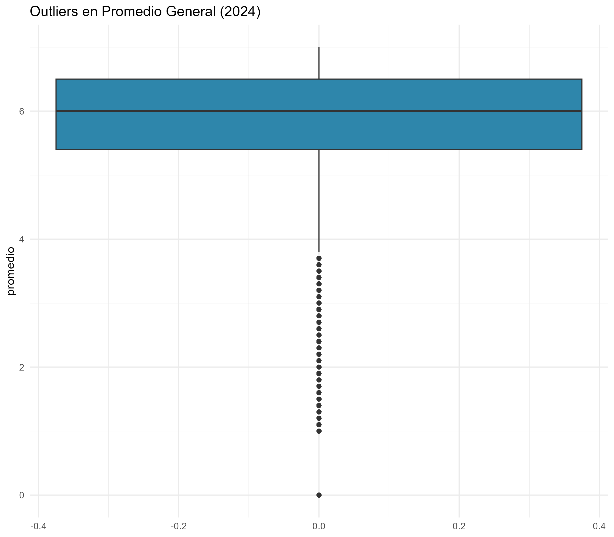  


#### 4.1.2 Outliers en porcentaje de asistencia

El porcentaje de asistencia presenta una distribución fuertemente concentrada en valores altos, tal como se observa en el histograma, donde la mayoría de los estudiantes se agrupan en el rango superior (75%–100% de asistencia). Para identificar valores atípicos, se aplicó un método de detección de outliers, lo que permitió identificar 340.040 casos con porcentajes de asistencia inusualmente bajos o altos, siendo la gran mayoría de estos valores extremadamente bajos.

Al analizar la distribución de estos outliers por nivel educativo, se observa que los cursos con mayor cantidad de casos atípicos son:

**1.** Educación Especial (53.301 casos)
**2.** 1° Medio HC (41.435 casos)
**3.** 3° Medio HC (32.574 casos)
**4.** 1° Básico (21.537 casos)
**5.** 2° Medio HC (21.227 casos)

Estos niveles concentran más del 50% de los outliers de asistencia, lo que sugiere que la inasistencia crítica está asociada principalmente a transiciones educativas (ingreso a la educación básica y media) y a modalidades de enseñanza diferenciada (Educación Especial)

El histograma complementa este hallazgo al mostrar que, aunque la distribución es masiva en altos porcentajes, existe una cola izquierda extendida que representa a aquellos estudiantes con asistencia muy baja, muchos de los cuales fueron identificados como outliers. Esta visualización permite confirmar que los outliers no son errores de medición, sino casos reales que merecen atención analítica y política.

*Outliers según tipo de dependencia*
  


**Gráfico**

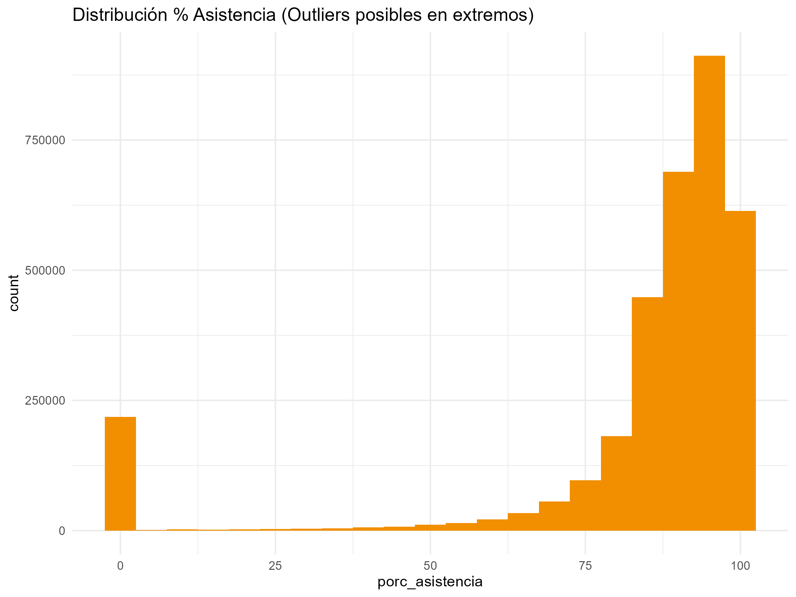  


### 4.2 Casos de excelencia académica (Valores extremos superiores)

Estos, si bien no son estrictamente outliers estadísticos, si són valores extremos que me interesan analizar, por lo que les di su espacio aquí.


#### 4.2.1 Estudiantes con promedios perfectos o casi perfectos

Primero, quise identificar a los estudiantes con promedios de excelencia académica. Para ello definí tres criterios de desempeño: promedio exactamente 7.0, promedio mayor o igual a 6.8 (considerado “muy alta excelencia”), y promedio mayor o igual a 6.5 (“excelencia amplia”). 

En base a esto, se aprecia que, de un total de aproximadamente 3.33 millones de estudiantes evaluados, solo el 0.98% obtuvo un promedio perfecto de 7.0 (32.704 estudiantes). Sin embargo, al ampliar el criterio a promedios iguales o superiores a 6.8, el porcentaje sube al 9.23% (307.348 estudiantes), y si se incluye a quienes tienen promedio igual o mayor a 6.5, la proporción alcanza al 26.83% (893.041 estudiantes). Esto indica que, aunque los promedios perfectos son escasos, hay un grupo significativo de estudiantes que logra desempeños cercanos a la excelencia académica.

**Resultados**

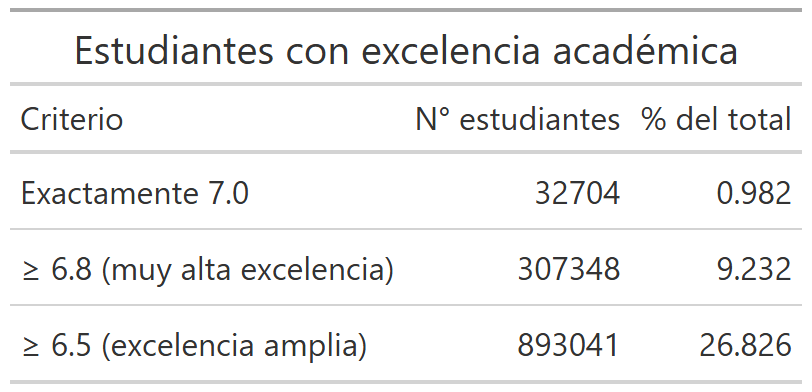  


#### 4.2.2 ¿En qué tipo de dependencia se concentran los 7.0 perfectos?

Ahora bien, quería saber si el tipo de dependencia del establecimiento se concentran los promedios perfectos. Por lo que contabilicé a estos estudiantes según el tipo de dependencia. Evidenciandose que se concentran principalmente en  establecimientos particulares subvencionados (46.74%, equivalente a 15.287 estudiantes), seguidos por los establecimientos municipales (24.95%, 8.160 estudiantes) y los particulares pagados (23.32%, 7.625 estudiantes). Los servicios locales de educación y las corporaciones administrativas delegadas representan una proporción mucho menor (4.63% y 0.36%, respectivamente). Esto refuerza nociones que vimos anteriormente de que los resultados académicos, incluyendo la excelencia académica están distribuidos de manera heterogénea entre los tipos de dependencia, con una ligera predominancia en el sector particular subvencionado.

**Resultados**

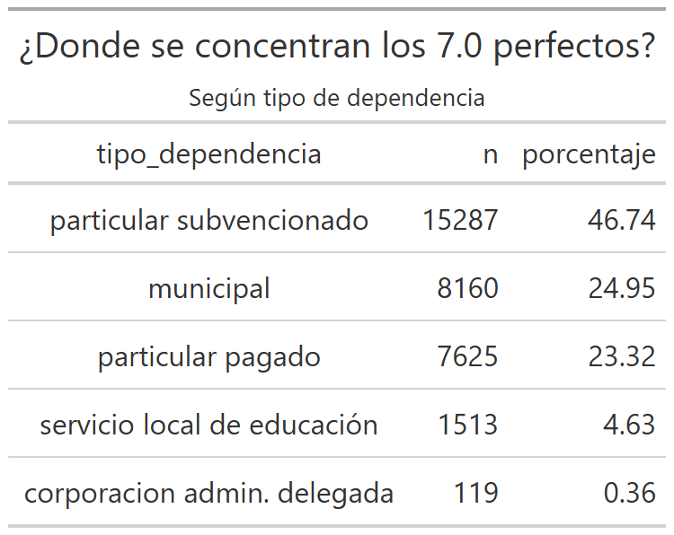  


**Gráfico**

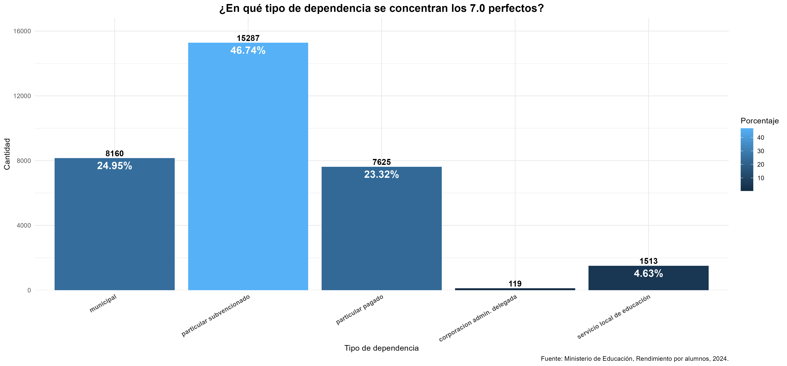  


---

## 5. Modelo de regresión simple: ¿Existe una relación entre la asistencia a clases y el promedio de notas del estudiante?

Para complementar el análisis descriptivo anterior, se realizó un modelo de regresión lineal simple con el objetivo de cuantificar la relación estadística entre el porcentaje de asistencia y el promedio general de notas. Esta aproximación permite ir más allá de las comparaciones por dependencia y evaluar en qué medida la asistencia escolar se asocia sistemáticamente con el desempeño académico en el sistema educativo chileno.

Con este análisis busco cuantificar estadísticamente una relación que suele asumirse en el discurso educativo: que una mayor asistencia se asocia con mejores resultados académicos.

Se aplicó un modelo lineal simple donde el promedio general funciona como variable dependiente y el porcentaje de asistencia como variable independiente. 

**Resultados**

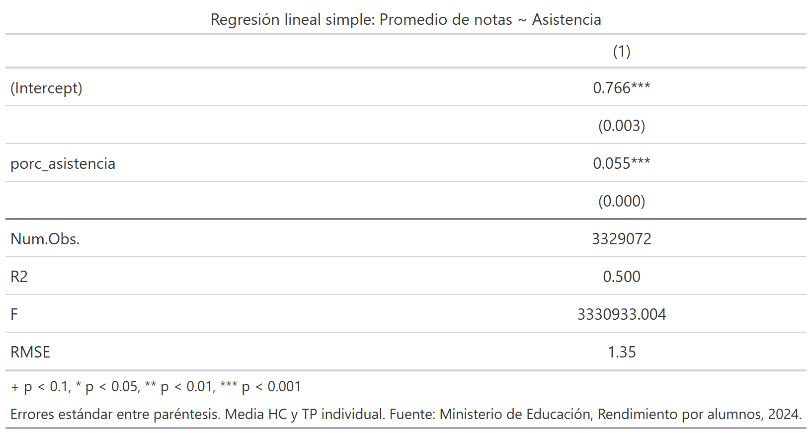  


El modelo revela una relación positiva y estadísticamente significativa entre asistencia y rendimiento académico. Por cada incremento de 1% en la asistencia, se espera un aumento de aproximadamente 0.055 puntos en el promedio general de notas (β = 0.055 (p < 0.001)). En términos prácticos, esto significa que un estudiante que aumenta su asistencia un 10% su asistencia subiría aproximadamente 0,55 puntos su promedio, lo cual es una magnitud relevante en el sistema escolar. El coeficiente de determinación (R²) de 0.5001 indica que la asistencia explica el 50% de la variación del promedio, lo cual la convierte en un predictor fuerte del promedio de notas.


**Gráfico**

La nube de puntos a simple vista no nos dice mucho (PORQUE HAY DEMASIADAS OBSERVACIONES AAAA), pero igual si uno mira de más lejos se logra encontrar una tendencia ascendente en estos, concentrandose más en la zona superior derecha del gráfico. La línea de regresión azul atraviesa diagonalmente el gráfico con una pendiente positiva.

Igualmente, llama la atención aquellas observaciones con 0% de asistencia y un promedio distinto a 0 o 1. 


  

---

## 6. Modelo de regresión múltiple: ¿Cómo se relaciona la asistencia con el promedio de notas de los estudiantes, y cómo esta relación varía según la dependencia administrativa, la modalidad educativa, el género y el contexto rural/urbano?

Con este modelo se busca identificar no solo el efecto directo, sino cómo cambian los efectos dependiendo del tipo de estudiante y establecimiento. Por lo que se incluyen variables de control de: tipo de dependencia, modalidad educativa, género y contexto de ruralidad. 

Sin embargo, no se incluyen todas las interacciones posibles entre las variables (esto fue prueba y error). Esto pues se decidió excluir interacciones que no tienen sentido a nivel práctico con el fin de tener un modelo más parsiomonioso y facil de interpretar.


**Resultados**

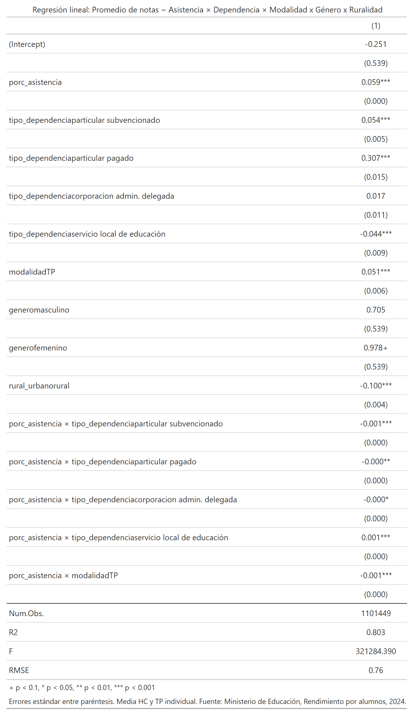  


A niveles generales, al revisar los resultados del modelo es posible identificar, a través del R² que este modelo explica el 80.3% de la variación del promedio de notas. Asimismo, tiene un RMSE de aproximadamente 0,76, implicando que los errores del modelo son relativamente bajos considerando que el promedio va de 1.0 a 7.0

Ahora bien, destacan ciertos coeficientes, siendo el primero el efecto principal de la asistencia, siendo muy significativo su resultado (porc_asistencia = 0.059 ***). Cada punto porcentual adicional de asistencia aumenta el promedio en 0,059 puntos, manteniendo todo lo demás constante. Es decir, un aumento de 10% de asistencia implica un aumento de 0,59 puntos en promedio. Significando, por ejemplo, que un estudiante que pasa de 80% a 90% de asistencia podría subir de 5,5 a aproximadamente 6,1 de promedio. De esta manera, la asistencia se consolida como uno de los predictores más fuertes del rendimiento.

Por otro lado, al investigar las diferencias entre dependencias, cuando la asistencia es 0, se da cuenta de diferencias significativas con los establecimientos municipales en los establecimientos particulares subvencionados, particulares pagados y servicios locales de educación (SLEP). Presentando los colegios pagados, en promedio, notas más altas, incluso controlando asistencia, género, modalidad y ruralidad (+0,054 y +0,307 respectivamente). Por otro lado, los SLEP muestran menores promedios (-0,044), lo que sugiere la posibilidad de existencia de brechas estructurales.

Luego, se evidencia que los estudiantes de modalidades Técnicas Profesionales (TP) tienen en promedio 0,05 puntos más que sus pares de HC, controlando por todo. 

Finalmente, en cuanto a los estudiantes de establecimientos rurales, estos presentan en promedio 0,1 punto menos que sus compañeros de establecimientos urbanos, con alta significancia estadística.

---

## 7. Análisis de Componentes Principales (intento)

En esta sección se buscará realizar un análisis de componentes principales. Se supone que debiera ser con varias variables numéricas pero en la base con la que se está realizando este trabajo hay solo 2 (promedio y porcentaje de asistencia), por lo que lo haremos funcionar! (o por lo menos lo intentaremos).

Adjunto el código con el que lo hice para revisar su realización:

```{r}
# Primero, se dejaron unicamente las variables numéricas y se eliminaron las na
datos_pca <- rendimiento_2024_final |>
  select(promedio, porc_asistencia) |>
  drop_na()

# Se revisan
dim(datos_pca)
head(datos_pca) #Todo bien!

# Ejecutar el PCA
pca_resultados <- prcomp(datos_pca, scale. = TRUE)
```


### 7.1 Varianza

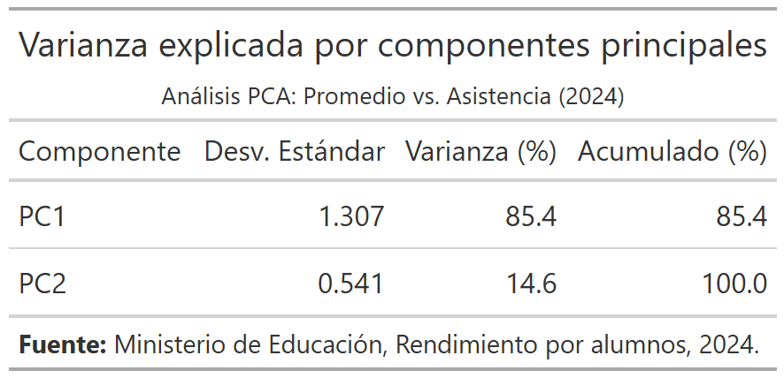  

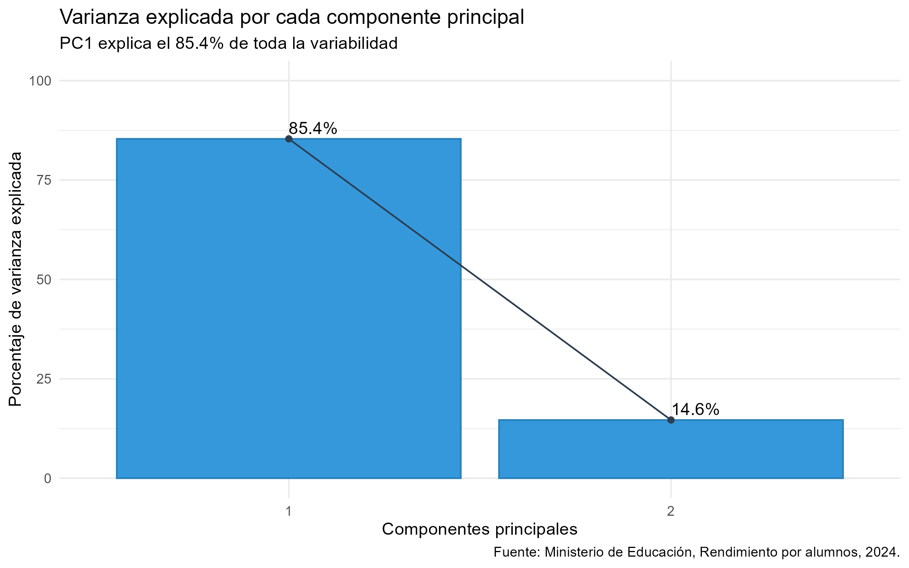  


### 7.2 Loadings

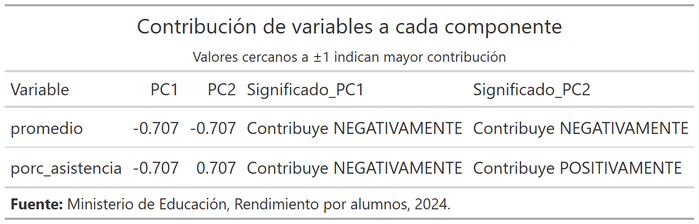 

 


### 7.3 Análisis PCA

El análisis de componentes principales (PCA) aplicado a las variables de promedio y porcentaje de asistencia permite combinarlas de la mejor manera posible en vez de analizarlas por separado.

Los resultados muestran que el 85.4% de toda la variación en los datos puede explicarse por una sola medida combinada (PC1). Este está asociado negativamente con ambas variables (cargas de -0,707). Es decir, valores altos en PC1 corresponden a estudiantes con bajo promedio y baja asistencia simultáneamente, mientras que valores bajos en PC1 representan el patrón opuesto (alto promedio y alta asistencia). Podemos llamar a esta medida desempeño académico integral.


El segundo componente (PC2), que explica el 14.6% restante representa casos excepcionales donde estas dos medidas no coinciden: estudiantes con buena asistencia pero mal promedio, o con mal asistencia pero buen promedio. Las variables están contrastadas: carga negativa para el promedio (-0.707) y positiva para la asistencia (0.707).  Si bien estos casos son minoritarios, siguen siendo importantes para identificar situaciones especiales. 

En conclusión, la predominancia de PC1 confirma que, en la mayoría de los casos, asistencia y rendimiento se alinean sistemáticamente en el sistema educativo.

---

## 8. Conclusión

A modo de conclusión, los análisis realizados permiten afirmar que el rendimiento académico de los estudiantes chilenos no es homogéneo, sino que varía sistemáticamente según características institucionales como individuales. 

En primer lugar, el tipo de dependencia administrativa emerge como un determinante clave del desempeño educativo. Los establecimientos particulares pagados y, en menor medida, los particulares subvencionados, muestran consistentemente mayores promedios, tasas de asistencia y proporciones de aprobación en comparación con los municipales y los administrados por Servicios Locales de Educación Pública (SLEP). Esta jerarquía se mantiene a lo largo de casi todos los niveles de enseñanza, evidenciando una reproducción de desigualdades estructurales a través del sistema educativo.

Las pruebas de hipótesis confirmaron relaciones estadísticamente significativas entre múltiples variables. Se detectaron diferencias en promedios entre modalidades educativas (HC vs. TP) y una asociación entre situación final y tipo de dependencia. Sin embargo, en algunos casos —como la relación entre modalidad y género— la significancia estadística no se tradujo en relevancia práctica, destacando la importancia de complementar los tests con análisis descriptivos y tablas de frecuencia.

En el análisis por modalidad educativa, se observó que los estudiantes de la modalidad Científico-Humanista (HC) presentan, en promedio, un rendimiento académico levemente superior al de sus pares de la modalidad Técnico-Profesional (TP). Sin embargo, esta diferencia en promedio no se traduce en una ventaja en la tasa de promoción, donde ambas modalidades muestran proporciones muy similares. Además, se identificó una composición de género ligeramente más equilibrada en HC, mientras que en TP se registra una mayor proporción de hombres, una diferencia que, si bien es estadísticamente detectable dada la gran muestra, resulta de magnitud reducida en la práctica. Estos matices refuerzan que, pese a las diferencias curriculares y de enfoque, ambas modalidades constituyen caminos formativos con resultados académicos comparables en términos de promoción.
En cuanto al ámbito territorial, los resultados contradicen ciertas expectativas iniciales. Los establecimientos rurales presentaron, en promedio, mejores resultados que los urbanos, mientras que la Región Metropolitana no mostró ventajas comparativas frente al resto del país. Estos hallazgos matizan la idea de que la concentración de recursos o población se traduce necesariamente en mejor rendimiento, e invitan a profundizar en factores locales y contextuales.

El análisis de outliers complementó esta visión al revelar que la dispersión del rendimiento no se distribuye uniformemente: los establecimientos municipales y particulares subvencionados concentran la mayor cantidad de valores extremos, tanto bajos como altos (como los promedios perfectos de 7.0). Esto refleja una mayor heterogeneidad interna en estos sectores.

Finalmente, los modelos de regresión confirmaron que la asistencia escolar es uno de los predictores más fuertes del rendimiento, con un efecto positivo y estadísticamente robusto. No obstante, incluso controlando por asistencia, variables como la dependencia administrativa, la modalidad educativa y la ruralidad mantuvieron efectos significativos, señalando que el desempeño académico resulta de una combinación de factores individuales y condicionantes estructurales. Asimismo, el análisis de componentes principales (PCA) confirmó la estrecha relación estructural entre asistencia y rendimiento académico. El primer componente, que explica el 85,4% de la variabilidad total, revela que ambas variables tienden a moverse conjuntamente: a mayor asistencia, mayor promedio, y viceversa. Esta dimensión subyacente de 'desempeño integral' sugiere que las políticas educativas deben abordar asistencia y rendimiento de manera integrada, no como problemas separados."

En conjunto, estos resultados refuerzan la necesidad de políticas educativas que reconozcan y aborden las brechas persistentes en el sistema, promoviendo no solo la excelencia académica, sino también la equidad en las trayectorias escolares.

**Conclusión personal:** Este trabajo me permitió poder repasar las distintas herramientas analíticas y responder varias dudas que me surgen al leer sobre educación. Valoro la oportunidad de poder aplicar practicamente los contenidos (creo que finalmente entendí PCA con esta tarea), especialmente porque lo puedo hacer sobre una temática que me gusta. 

**Fuente**: Ministerio de Educación – Rendimiento por alumnos 2024  
**Autora**: María Gracia Abbott Contreras – Noviembre–Diciembre 2025

¡Gracias por llegar hasta aquí!
